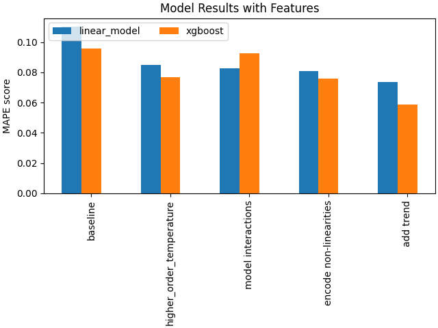
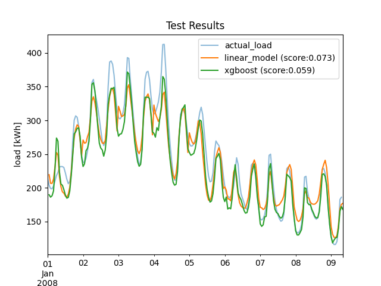

# Electricity Demand Forecasting

An end-to-end pipeline using temperature data for prediction electricity demand.

## Project Description

The repository includes exploration, training, and inference pipelines for an interpretable linear model (interpretable) and Xgboost model.

MAPE: 6.7% ranks 24th, globally in the BigDEAL [Global Energy forecasting competition](https://en.wikipedia.org/wiki/Global_Energy_Forecasting_Competition).

## Dashboard Snapshot
The [interactive UI](https://electricity-demand-prediction.streamlit.app/) provides an interface for viewing the result of different trained models as well as exploring the data. A snapshot of the dashboard is available here:


## Modelling Results
The figure shows the influence of added features on the model performance (MAPE); and the test result for the best version of each model, as explored in the notebook [here](./notebooks/03-training.ipynb). 

 


## Reproducing Dashboard
The dashboard provides an interactive interface for viewing the result of different trained models as well as exploring the data.

To launch dashboard:

1. clone the repo.
2. go to the project root

3. Run the following command at project root

```
python -m streamlit run src/gui_app/app.py
```

## Project Organization

-------------------------
```
.
├── config
├── data
│   ├── eval_data
│   ├── processed
│   └── raw
├── models
│   └── features
├── notebooks
└── src
    ├── gui_app
    │   └── app_pages
    ├── inference
    ├── modelling
    └── preprocessing
```

## Technologies

- Numpy
- Scipy
- Scikit-learn
- matplotlib
- etc.